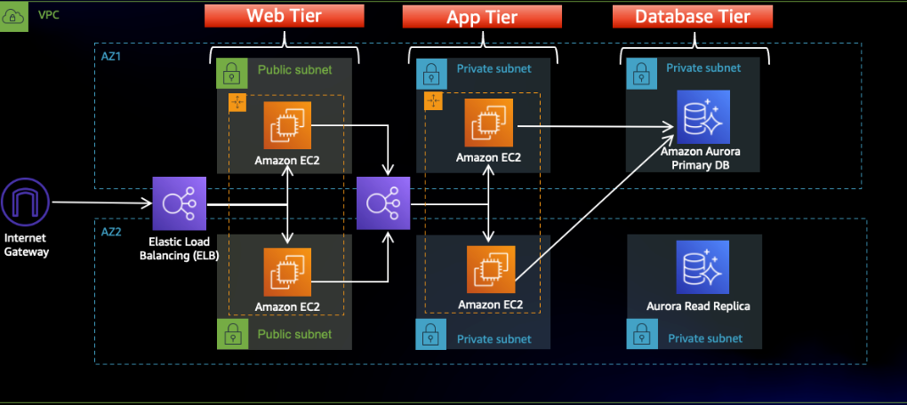

# Three-Tier Web Application on AWS

A scalable and highly available three-tier web architecture deployed on AWS with automated infrastructure provisioning and load balancing.

## Overview

This project implements a production-grade three-tier web architecture on Amazon Web Services. The architecture separates presentation, application, and database layers to ensure scalability, maintainability, and high availability across multiple availability zones.

## Architecture

The application is structured into three distinct tiers:

**Web Tier**  
The presentation layer runs on EC2 instances behind a public-facing Application Load Balancer. Nginx web servers host a React.js frontend application and forward API requests to the application tier.

**Application Tier**  
The business logic layer consists of Node.js servers running on EC2 instances behind an internal Application Load Balancer. This tier processes requests from the web tier and communicates with the database layer.

**Database Tier**  
Aurora MySQL database deployed in a multi-AZ configuration provides data persistence with automatic failover capabilities for high availability.

## Network Design

**VPC Configuration**  
Custom VPC with public and private subnets across multiple availability zones for redundancy and fault tolerance.

**Public Subnets**  
Host the web tier EC2 instances and public-facing Application Load Balancer with internet gateway access.

**Private Subnets**  
Contain the application tier EC2 instances, internal Application Load Balancer, and Aurora RDS database instances with no direct internet access.

**NAT Gateway**  
Enables private subnet instances to access the internet for updates and external API calls while preventing inbound connections.

## High Availability Features

**Multi-AZ Deployment**  
All tiers are deployed across multiple availability zones to ensure service continuity in case of zone failure.

**Load Balancing**  
Two Application Load Balancers distribute traffic: a public ALB for external traffic to the web tier, and an internal ALB for traffic between web and application tiers.

**Auto Scaling**  
Auto Scaling Groups at web and application tiers automatically adjust capacity based on demand.

**Database Failover**  
Aurora MySQL automatic failover to standby replica ensures database availability.

**Health Checks**  
Application Load Balancers perform health checks and route traffic only to healthy instances.

## Technology Stack

**Frontend:** React.js  
**Web Server:** Nginx  
**Backend:** Node.js  
**Database:** Amazon Aurora MySQL  
**Load Balancing:** AWS Application Load Balancer  
**Compute:** Amazon EC2  
**Storage:** Amazon S3  
**Networking:** AWS VPC, Internet Gateway, NAT Gateway  
**Security:** Security Groups, Network ACLs

## Key Components

**Public-Facing Application Load Balancer**  
Routes external HTTP/HTTPS traffic to web tier instances with SSL termination and health monitoring.

**Web Tier Auto Scaling Group**  
Maintains desired number of web server instances and scales based on CPU utilization or request count.

**Internal Application Load Balancer**  
Distributes traffic from web tier to application tier without exposing application servers to the internet.

**Application Tier Auto Scaling Group**  
Scales Node.js application servers based on demand while maintaining availability.

**Aurora MySQL Database Cluster**  
Provides managed relational database with automated backups, point-in-time recovery, and read replicas.

## Security Implementation

**Network Isolation**  
Application and database tiers are isolated in private subnets with no direct internet access.

**Security Groups**  
Configured to allow only necessary traffic between tiers and deny all other inbound connections.

**Database Security**  
Aurora database accepts connections only from application tier security group on MySQL port 3306.

**Principle of Least Privilege**  
IAM roles and policies grant minimal permissions required for each service.

## Deployment

The infrastructure is deployed using AWS services with the following configuration:

**VPC Setup**  
Create VPC with public and private subnets across multiple availability zones.

**Internet Connectivity**  
Configure Internet Gateway for public subnets and NAT Gateway for private subnet internet access.

**Security Configuration**  
Define security groups for each tier with appropriate inbound and outbound rules.

**Database Provisioning**  
Deploy Aurora MySQL cluster in private subnets with multi-AZ configuration.

**Application Deployment**  
Launch EC2 instances for web and application tiers with Auto Scaling Groups.

**Load Balancer Configuration**  
Set up public ALB for web tier and internal ALB for application tier with health checks.

## Scalability

The architecture scales horizontally at both web and application tiers through Auto Scaling Groups. As traffic increases, additional EC2 instances are automatically launched and registered with the appropriate load balancer. Aurora MySQL provides read scaling through read replicas.

## Cost Optimization

**Right-Sizing**  
EC2 instances are sized appropriately for workload requirements.

**Auto Scaling**  
Automatically reduces capacity during low-traffic periods to minimize costs.

**Reserved Instances**  
Baseline capacity can use Reserved Instances for cost savings.

## Monitoring

**CloudWatch Metrics**  
Monitor CPU utilization, network traffic, request counts, and database performance.

**Application Load Balancer Metrics**  
Track request count, target response time, and HTTP error rates.

**Auto Scaling Activities**  
Monitor scaling events and adjust policies based on application behavior.

## Getting Started

### Prerequisites

- AWS account with appropriate permissions
- AWS CLI configured with credentials
- Basic understanding of VPC, EC2, RDS, and load balancing concepts

### Setup Instructions

Deploy the VPC and networking components including subnets, route tables, and gateways.

Create security groups for web tier, application tier, and database tier with appropriate rules.

Launch Aurora MySQL database cluster in private subnets.

Configure and deploy web tier EC2 instances with Nginx and React application.

Configure and deploy application tier EC2 instances with Node.js backend.

Set up Application Load Balancers for both public and internal traffic routing.

Configure Auto Scaling Groups for web and application tiers.

Test the application by accessing the public load balancer endpoint.

## Application Configuration

**Web Tier**  
Nginx configuration forwards API calls to internal load balancer while serving static React content.

**Application Tier**  
Node.js application connects to Aurora database and exposes REST API endpoints.

**Database Connection**  
Application tier uses Aurora cluster endpoint for writes and reader endpoint for read operations.

## Author

**Hammad Khalid**  
DevOps Engineer | AWS, Infrastructure Architecture, Cloud Solutions

GitHub: https://github.com/hammad558  
LinkedIn: https://linkedin.com/in/hammad-khalid99  

## License

This project is licensed under the MIT License.
